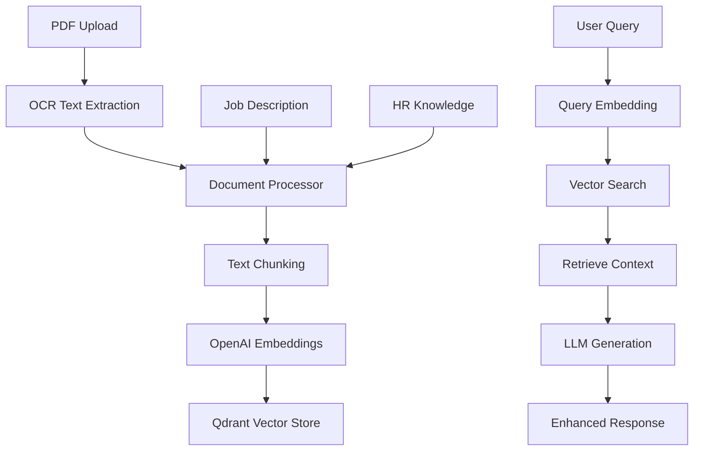

# 🧠 RAG Architecture для SmartBot HR

## Обзор

RAG (Retrieval-Augmented Generation) система интегрирована в SmartBot HR для улучшения качества AI-агентов через векторный поиск по базе знаний.

## 🏗️ Архитектура

### Компоненты

1. **Qdrant Vector Database** - векторная БД для хранения эмбеддингов
2. **OpenAI Embeddings** - генерация векторных представлений текста
3. **Document Processor** - обработка и чанкинг документов
4. **RAG Service** - основной сервис для RAG операций
5. **Enhanced AI Agents** - AI агенты с RAG возможностями

### Схема данных



## 📊 База знаний

### Типы документов

1. **Job Descriptions** - описания вакансий
2. **CV Texts** - тексты резюме кандидатов
3. **HR Knowledge** - HR best practices, вопросы для интервью
4. **IT Skills Taxonomy** - таксономия IT навыков
5. **Salary Benchmarks** - зарплатные вилки

### Структура данных

```json
{
  "text": "Текст документа",
  "metadata": {
    "source": "job_description|cv_text|hr_knowledge",
    "type": "job|candidate|knowledge",
    "job_id": "uuid",
    "candidate_id": "uuid",
    "title": "string",
    "location": "string"
  },
  "vector": [0.1, 0.2, ...] // 1536 dimensions
}
```

## 🔧 API Endpoints

### RAG Operations

- `POST /rag/initialize` - инициализация RAG сервиса
- `POST /rag/search` - поиск по базе знаний
- `POST /rag/generate-response` - генерация ответа с RAG
- `POST /rag/add-job/{job_id}` - добавление вакансии в БЗ
- `POST /rag/add-candidate/{candidate_id}` - добавление кандидата в БЗ

### Enhanced Analysis

- `POST /rag/enhance-mismatch-analysis` - улучшенный анализ несоответствий
- `POST /rag/generate-questions` - генерация вопросов с RAG

## 🚀 Использование

### 1. Инициализация

```python
# Инициализация RAG сервиса
await rag_service.initialize()

# Добавление HR знаний
hr_knowledge = get_hr_knowledge()
for knowledge in hr_knowledge:
    await rag_service.add_hr_knowledge(knowledge)
```

### 2. Добавление документов

```python
# Добавление вакансии
job_data = {
    "id": "uuid",
    "title": "Python Developer",
    "description": "...",
    "requirements": ["Python", "Django"],
    "location": "Almaty"
}
await rag_service.add_job_description(job_data)

# Добавление резюме
cv_data = {
    "id": "uuid",
    "full_name": "John Doe",
    "resume_text": "...",
    "city": "Almaty"
}
await rag_service.add_cv_text(cv_data)
```

### 3. Поиск и генерация

```python
# Поиск релевантного контекста
results = await rag_service.search_relevant_context(
    "Python developer with Django experience",
    context_type="job",
    limit=5
)

# Генерация ответа с RAG
response = await rag_service.generate_rag_response(
    "What skills are required for this position?",
    context_type="job",
    max_context=3
)
```

## 🔄 Интеграция с AI агентами

### Enhanced Mismatch Agent

```python
# Анализ с RAG
analysis = await rag_enhanced_mismatch_agent.analyze_with_rag(
    job_text, cv_text, hints
)

# Результат включает:
# - basic_analysis: стандартный анализ
# - rag_insights: RAG инсайты
# - enhanced_mismatches: улучшенные несоответствия
```

### Enhanced Question Generator

```python
# Генерация вопросов с RAG
questions = await rag_enhanced_question_generator.generate_questions_with_rag(
    job_struct, cv_struct, mismatches, missing_data
)

# Результат включает:
# - basic_questions: стандартные вопросы
# - rag_questions: RAG-генерированные вопросы
# - combined_questions: объединенные и приоритизированные
```

## 📈 Преимущества RAG

### 1. **Улучшенная точность**
- Контекст из похожих вакансий и резюме
- HR best practices в анализе
- Более релевантные вопросы

### 2. **Масштабируемость**
- Автоматическое обновление базы знаний
- Обучение на исторических данных
- Адаптация к новым типам вакансий

### 3. **Персонализация**
- Учет специфики компании
- Адаптация к региональным особенностям
- Учет отраслевых стандартов

## 🛠️ Настройка

### Environment Variables

```bash
# Qdrant
QDRANT_HOST=localhost
QDRANT_PORT=6333

# OpenAI
OPENAI_API_KEY=your_key_here
OPENAI_MODEL=gpt-4o-mini
```

### Docker Compose

```yaml
services:
  qdrant:
    image: qdrant/qdrant:latest
    ports:
      - "6333:6333"
    volumes:
      - qdrant_data:/qdrant/storage
```

## 📊 Мониторинг

### Метрики

- Количество документов в БЗ
- Качество поиска (precision/recall)
- Время ответа RAG запросов
- Использование контекста в ответах

### Логирование

```python
logger.info(f"Added {len(documents)} documents to vector store")
logger.info(f"RAG search returned {len(results)} results")
logger.info(f"RAG confidence: {confidence}")
```

## 🔮 Будущие улучшения

1. **Fine-tuning эмбеддингов** на HR данных
2. **Мультимодальный RAG** для изображений в резюме
3. **Real-time обновления** базы знаний
4. **A/B тестирование** разных RAG стратегий
5. **Federated learning** между компаниями

## 📚 Ресурсы

- [Qdrant Documentation](https://qdrant.tech/documentation/)
- [OpenAI Embeddings](https://platform.openai.com/docs/guides/embeddings)
- [LangChain RAG](https://python.langchain.com/docs/use_cases/question_answering/)
- [Vector Search Best Practices](https://qdrant.tech/articles/vector-search-best-practices/)
